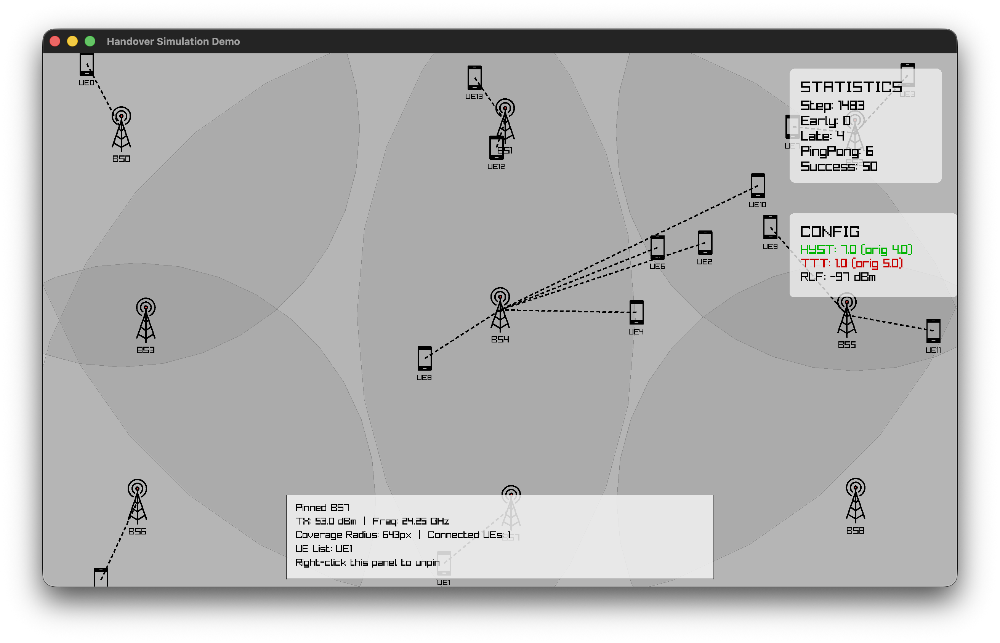

# handover-env

Raylib-based cellular handover simulator with interactive visualization.

The project models UE mobility, RSRP-driven handovers, SON parameter tuning, and an interactive renderer for debugging handover behavior.



## Features

- 5G baseline simulation config (`24.25 GHz`, configurable TX power and thresholds)
- Naive handover algorithm with hysteresis margin + time-to-trigger (TTT)
- Handover classification metrics: early, late, ping-pong, success
- Link termination handling when no serving BS is valid
- SON tuning for `HYSTERISIS_MARGIN` and `TIME_TO_TRIGGER` on failure events
- Interactive Raylib UI with:
  - coverage regions
  - UE/BS icon rendering from PNG assets
  - hover tooltips
  - pin panels (UE/BS)
  - flashing connection diagnostics (red=failure, green=successful handover)

## Project Index

| Path | Purpose |
|---|---|
| `main.py` | CLI entrypoint and scenario runner |
| `simulation/config.py` | Core simulation config dataclass and defaults |
| `simulation/simulator.py` | Main simulation step loop and SON trigger logic |
| `simulation/scenario_configs.py` | Prebuilt linear/realistic scenarios and network factories |
| `simulation/statistics.py` | Statistics counters |
| `algorithms/handover.py` | Handover decision algorithm (`naive_handover`) |
| `core/ue_bs_helpers.py` | Mobility updates, RSRP calculation, handover execution routing |
| `core/handover_helpers.py` | Handover type detection and handover execution helpers |
| `core/son.py` | SON tuning strategy |
| `entities/` | Domain entities (`UE`, `BaseStation`, `Network`, handover state, policy) |
| `rendering/renderer.py` | Main renderer and interaction handling |
| `rendering/entities.py` | UE/BS icon drawing + connection lines |
| `rendering/config.py` | Rendering config (colors, icon scales, sizes) |
| `rendering/statistics.py` | Statistics/config UI panels |
| `loggers/` | Structured event/error logging helpers |
| `bs.png`, `ue.png` | Icon assets used by renderer |
| `handover-env.png` | Project screenshot used in this README |

## Requirements

- Python `>=3.14`
- GUI-capable environment (Raylib windowing)

Dependencies (from `pyproject.toml`):

- `numpy>=2.4.3`
- `raylib>=5.5.0.4`

## Setup

```bash
git clone <your-repo-url>
cd handover-env
uv sync
```

If your shell does not auto-activate environments:

```bash
source .venv/bin/activate
```

## Running the Simulator

Default run (`realistic` scenario, up to 1000 steps):

```bash
python3 main.py
```

Run explicit scenario:

```bash
python3 main.py linear
python3 main.py realistic
python3 main.py test
```

Run for a fixed number of steps:

```bash
python3 main.py realistic --max-steps 2000
```

Run until interrupted:

```bash
python3 main.py realistic --run-forever
```

Stop with `Ctrl+C`, `ESC`, or by closing the window.

## UI Controls

- Hover UE/BS: show tooltip
- Left click UE: pin UE panel
- Left click BS: pin BS panel
- Right click pinned panel: unpin that panel

Pin panels display serving/connection context and are useful for live debugging.

## Scenarios

### `linear`

- Pure linear movement
- Spread-out BS and UE topology
- Different UE speeds

Defaults: `8 BS`, `12 UE`.

### `realistic`

- Mixed random + linear UE movement
- Jittered BS placement
- Heterogeneous BS TX powers

Defaults: `9 BS`, `14 UE`.

### `test`

- Small deterministic network (`3 BS`, `2 UE`) for quick sanity checks.

## Simulation Model Notes

- Path-loss model uses reference-distance + exponent form.
- 5G baseline defaults:
  - `DEFAULT_FREQUENCY = 24.25e9`
  - `DEFAULT_TX_POWER = 53.0`
  - `RLF_FAILURE_THRESHOLD = -97`
- Link is terminated when no BS has acceptable signal quality.

## Metrics

Tracked in `SimulationStatistics`:

- `early_handover_count`
- `late_handover_count`
- `ping_pong_handover_count`
- `successful_handover_count`

Late failures also include disconnection-driven failures.

## SON Behavior

When new failure events occur, SON updates:

- `HYSTERISIS_MARGIN`
- `TIME_TO_TRIGGER`

Config panel shows current and original values:

- Green text: increased vs original
- Red text: decreased vs original

## Rendering Notes

- Theme: white/black/gray base for clarity
- Connection overlays:
  - Red flashing line: failure condition
  - Green flashing line: recent successful handover
- UE/BS labels are rendered below icon sprites for readability

Icon scaling is configurable in `RendererConfig`:

- `bs_icon_scale`
- `ue_icon_scale`

## RL Agent Training

This project includes two interchangeable RL agents for learning optimized handover policies: **Q-Learning** (tabular) and **REINFORCE** (policy gradient). Both agents are trained on the same simulation environment and can be compared.

### Architecture Overview

- **Base Interfaces** (`core/rl_base.py`): `BaseRLAgent` and `RLHandoverPolicyBase` define the contract that all agents follow
- **Centralized Encoders** (`core/state_encoding.py`): 
  - `encode_state_discrete()` for Q-Learning (4×4×3 state space)
  - `encode_state_continuous()` for REINFORCE (5D normalized vector)
- **Modular Wrappers**: `RLHandoverPolicy` (Q-Learning) and `REINFORCEHandoverPolicy` conform to `HandoverPolicy` interface

### Training Q-Learning Agent

Q-Learning uses a tabular approach with epsilon-greedy exploration. State is discretized into (RSRP bin, delta bin, TTT status) tuples.

**Basic Training:**

```bash
python3 main.py realistic --mode train --episodes 500 --max-steps 1000
```

**With Custom Hyperparameters:**

```bash
python3 main.py realistic --mode train \
  --episodes 1200 \
  --max-steps 1000 \
  --alpha 0.1 \
  --gamma 0.95 \
  --epsilon-decay 0.996
```

**Save Checkpoint:**

```bash
python3 main.py linear --mode train \
  --episodes 800 \
  --max-steps 1000 \
  --checkpoint checkpoints/ql_linear_800ep.pkl
```

**Training Parameters:**

| Parameter | Default | Description |
|-----------|---------|-------------|
| `--episodes` | 1200 | Number of training episodes |
| `--max-steps` | 1000 | Steps per episode |
| `--alpha` | 0.1 | Learning rate (TD update weight) |
| `--gamma` | 0.95 | Discount factor (importance of future rewards) |
| `--epsilon-decay` | 0.996 | Decay rate for exploration ε per episode |
| `--checkpoint` | None | Path to save trained agent (.pkl file) |

**What to Expect:**

- Episode 1-100: High exploration, high failure rates (early/late HO, ping-pong)
- Episode 100-500: Q-table grows, failure rates decrease
- Episode 500+: Convergence plateau, stable performance
- Final Q-table size: typically 200-500 states

**Output Example:**

```
Ep  25 | ε=0.8765 | Q-states:  42 | Late:  3 | PP:  2 | Success: 15
Ep  50 | ε=0.7689 | Q-states:  98 | Late:  2 | PP:  1 | Success: 18
Ep 100 | ε=0.5876 | Q-states: 156 | Late:  1 | PP:  0 | Success: 19
```

### Training REINFORCE Agent

REINFORCE uses policy gradient optimization with a small neural network (5D → 32 → 32 → 2). State is continuous and normalized to [-1, 1].

**Basic Training:**

```bash
python3 main.py realistic --mode train-reinforce --episodes 500 --max-steps 1000
```

**With Custom Hyperparameters:**

```bash
python3 main.py realistic --mode train-reinforce \
  --episodes 1200 \
  --max-steps 1000 \
  --lr 3e-4 \
  --gamma 0.97 \
  --checkpoint checkpoints/reinforce_linear.pt
```

**Training Parameters:**

| Parameter | Default | Description |
|-----------|---------|-------------|
| `--episodes` | 1200 | Number of training episodes |
| `--max-steps` | 1000 | Steps per episode |
| `--lr` | 3e-4 | Adam learning rate for policy network |
| `--gamma` | 0.97 | Discount factor for return computation |
| `--checkpoint` | None | Path to save trained agent (.pt file) |

**What to Expect:**

- Episode 1-50: High variance, policy unstable
- Episode 50-200: Policy stabilizing, variance decreasing via baseline subtraction
- Episode 200+: Smooth convergence with occasional variance spikes
- Entropy bonus (0.01 weight) prevents premature convergence

**Output Example:**

```
Ep   50 | Loss=   1.3456 | Late:  4 | PP:   3 | Success: 13
Ep  100 | Loss=   0.8234 | Late:  2 | PP:   1 | Success: 17
Ep  200 | Loss=   0.4567 | Late:  1 | PP:   0 | Success: 19
```

### Evaluating Trained Agents

Evaluate a trained Q-Learning agent (epsilon=0, pure exploitation):

```bash
python3 main.py realistic --mode eval \
  --load-checkpoint checkpoints/ql_linear_800ep.pkl \
  --max-steps 1000
```

Example evaluation runs the agent on 10 episodes with no exploration.

**Output Summary:**

```
Eval Ep 10 | Late: 0 | PP: 0 | Success: 20

Evaluation Summary (RL Agent)
===================================================================
Avg Late Handovers: 0.20
Avg Ping-Pong Handovers: 0.10
Avg Successful Handovers: 19.70
```

### Comparing Agents

To systematically compare Q-Learning and REINFORCE:

**Step 1: Train both agents on the same scenario (linear, realistic, or test)**

```bash
# Train Q-Learning
python3 main.py realistic --mode train --episodes 1000 --checkpoint ql_vs_rf/ql_trained.pkl

# Train REINFORCE
python3 main.py realistic --mode train-reinforce --episodes 1000 --checkpoint ql_vs_rf/rf_trained.pt
```

**Step 2: Evaluate both on the same test set**

```bash
# Evaluate Q-Learning
python3 main.py realistic --mode eval --load-checkpoint ql_vs_rf/ql_trained.pkl --max-steps 1000

# Evaluate REINFORCE (note: for eval, you'd need to implement a wrapper,
# or manually instantiate and evaluate using Python)
```

**Comparison Metrics (from evaluation output):**

| Metric | Interpretation |
|--------|-----------------|
| Avg Late Handovers | Lower is better (fewer RLF events) |
| Avg Ping-Pong Handovers | Lower is better (less oscillation) |
| Avg Successful Handovers | Higher is better (more stable handovers) |

**Manual Comparison Script:**

Create a script `compare_agents.py` to run both and collect stats:

```python
from algorithms.q_learning import QAgent, QLearningConfig
from algorithms.rl_policy import RLHandoverPolicy
from algorithms.reinforce import REINFORCEAgent
from algorithms.reinforce_policy import REINFORCEHandoverPolicy
from simulation.scenario_configs import create_network_realistic, REALISTIC_MOBILITY_CONFIG
from core.reward import compute_reward
import copy

# Load agents
ql_agent = QAgent(QLearningConfig())
ql_agent.load("ql_vs_rf/ql_trained.pkl")
ql_policy = RLHandoverPolicy(ql_agent)
ql_agent.config.epsilon = 0.0  # Evaluation mode

rf_agent = REINFORCEAgent(state_dim=5)
rf_agent.load("ql_vs_rf/rf_trained.pt")
rf_policy = REINFORCEHandoverPolicy(rf_agent, training=False)

# Run evaluation on test network
config = REALISTIC_MOBILITY_CONFIG
network = create_network_realistic()

# (Evaluation loop similar to main.py _eval_rl_agent function)
# Compare metrics and print side-by-side
```

### Training Tips

**For Q-Learning:**
- Start with `--alpha 0.1, --gamma 0.95, --epsilon-decay 0.995`
- Increase episodes if Q-table is still growing (check convergence)
- Use smaller scenarios (linear) for faster initial testing
- Monitor Q-table size: if >500 states, consider more discretization bins

**For REINFORCE:**
- Start with `--lr 3e-4, --gamma 0.97`
- Increase lr slightly (5e-4) if loss plateaus too early
- Decrease lr (1e-4) if loss oscillates wildly
- Baseline subtraction (enabled by default) is critical for variance reduction

**Hybrid Approach:**
1. Train Q-Learning on a small scenario (test) for 100 episodes to get quick baseline
2. Train REINFORCE on realistic scenario for 500+ episodes
3. Evaluate both on the same held-out scenario for fair comparison

## Customization Quick Guide

- Simulation behavior: `simulation/config.py`, `simulation/scenario_configs.py`
- Handover algorithm: `algorithms/handover.py`
- SON policy: `core/son.py`
- Visuals and icon scales: `rendering/config.py`
- Renderer interactions: `rendering/renderer.py`
- RL agent architectures: `algorithms/q_learning.py`, `algorithms/reinforce.py`
- Reward function: `core/reward.py`

## Notes

- This project is intentionally modular: algorithm, simulator, rendering, and env wrappers are decoupled.
- The current handover policy is a baseline naive algorithm intended to be replaced by improved or learned policies.
- Both RL agents are swappable via the same `HandoverPolicy` interface, enabling fair side-by-side comparison.
- Q-Learning converges faster on simple scenarios but may struggle with continuous state spaces.
- REINFORCE scales better to complex scenarios but requires more careful hyperparameter tuning.
